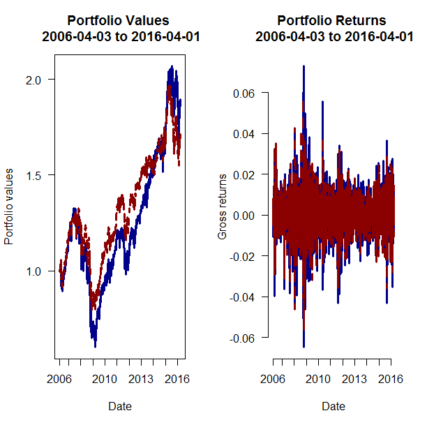
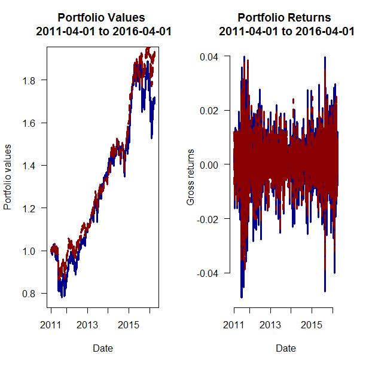
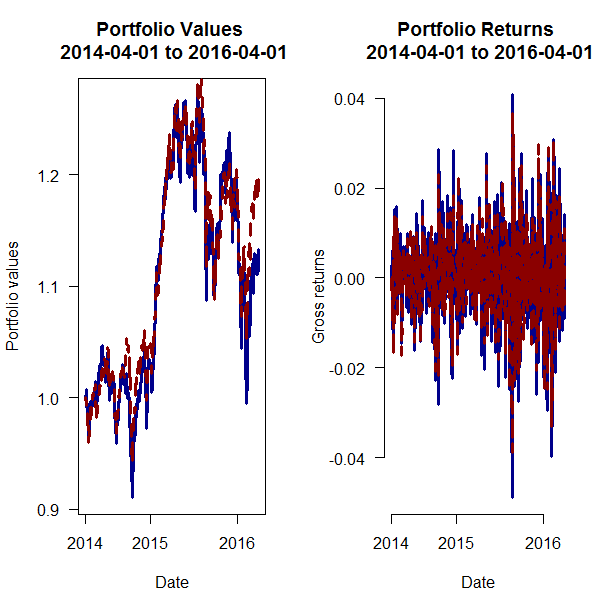

[](http://quantlet.de/index.php?p=info)

## [](http://quantlet.de/) **MVA_pcastockselection_results** [](http://quantlet.de/d3/ia)

```yaml

Name of Quantlet: MVA_pcastockselection_results
 
Published in: MVA

Description: ’This quantlet produces plots to illustrate the results of the principal component 
selection process. Stocks are iteratively selected according to their contribution
to principal components. For each portfolio the performance is plotted and the time
series of returns.'

Keywords: pca, time series, plot, returns, stock selection, portfolio management 
     
See also: 'MVA_pcastockselection_algorithm, MVA_pcastockselection_datapreperation'

Author: Christoph Schult

Datafile: Portfolios2014to2016.dat, Portfolios2011to2016.dat, Portfolios2006to2016.dat
     
Output: 'Three plots for PCA portfolio returns and values for different time periods. All 
portfolios constructed according to pca (red) are compared to the  portfolio with
all members of the index (blue). The asset universe are constituents in the STOXX
EUROPE 600 index.'

```







```r

# === input parameters ===
rm(list = ls())
# define paths and filenames
sPathRoot = "C:/"  # for MAC '/Users/'
sReadDataFile = c("Portfolios2014to2016.dat", "Portfolios2011to2016.dat", "Portfolios2006to2016.dat")
# define auxiliary parameters for the data
sDateFormat = "%d.%m.%Y"
# define returns
sTypeReturns = "grossreturn"
iStepSize = 1

# set working directory
setwd(sPathRoot)

# function to compute returns for a vector
returnsfun = function(x) {
  n = length(x)
  switch(sTypeReturns, grossreturn = (x[(iStepSize + 1):n] - x[1:(n - iStepSize)])/x[1:(n - iStepSize)], logreturn = diff(log(x), 
                                                                                                                          iStepSize))
}


# === general graphical parameters ===
plotportfolios = function(sFileName) {
  
  # open new device
  dev.new()
  # defines general plot characteristics
  par(las = 1, font = 1, font.axis = 1, font.main = 2, mfrow = c(1, 2))
  
  # Determine which frequency for x axis should be displayed
  sDateFormat = "%Y-%m-%d"
  sFreq = "%Y"
  
  # === read portfolios === read portfolio
  input = read.table(sFileName)
  # define date vector
  iadates = input$Dates
  # define original portfolio
  pfallassets = input$PFallassets
  # returns original portfolios
  retallassets = returnsfun(pfallassets)
  # define portfolio constructed by pca
  pfoptassets = input$PFoptassets
  # returns optimal portfolios
  retoptassets = returnsfun(pfoptassets)
  
  # define main titles
  sEndDate = as.character(iadates[length(iadates)])
  sStartDate = as.character(iadates[1])
  sMainValues = paste("Portfolio Values \n", sStartDate, "to", sEndDate, sep = " ")
  sMainReturns = paste("Portfolio Returns \n", sStartDate, "to", sEndDate, sep = " ")
  
  # === create plot for portfolio values ===
  
  # creating labels for x axis
  xlabelshelp = format(as.Date(iadates, sDateFormat), sFreq)
  xlabels = unique(xlabelshelp)
  createticks = function(x) {
    y = min(which(x == xlabelshelp))
  }
  xtickpos = as.numeric(sapply(xlabels, createticks))
  
  # create plot
  plot(pfallassets, type = "l", lwd = 3, lty = 1, col = "darkblue", frame = TRUE, axes = FALSE, xlab = "Date", ylab = "Portfolio values", 
       main = sMainValues)
  # add values for portfolio with selected consts according to pca
  lines(pfoptassets, lwd = 3, lty = 2, col = "darkred")
  # add y axis
  axis(side = 2, lwd = 0.5)
  # add x axis
  axis(side = 1, at = xtickpos, label = xlabels, lwd = 0.5)
  
  # === plot returns === create plot for returns
  plot(retallassets, type = "l", lwd = 3, lty = 1, col = "darkblue", frame = FALSE, axes = FALSE, xlab = "Date", ylab = "Gross returns", 
       main = sMainReturns)
  lines(retoptassets, lwd = 3, lty = 2, col = "darkred")
  
  # Format the y axis
  axis(side = 2, lwd = 0.5)
  # Format the x axis
  axis(side = 1, at = xtickpos, label = xlabels, lwd = 0.5)
}

# create plots
lapply(sReadDataFile, plotportfolios)
```
