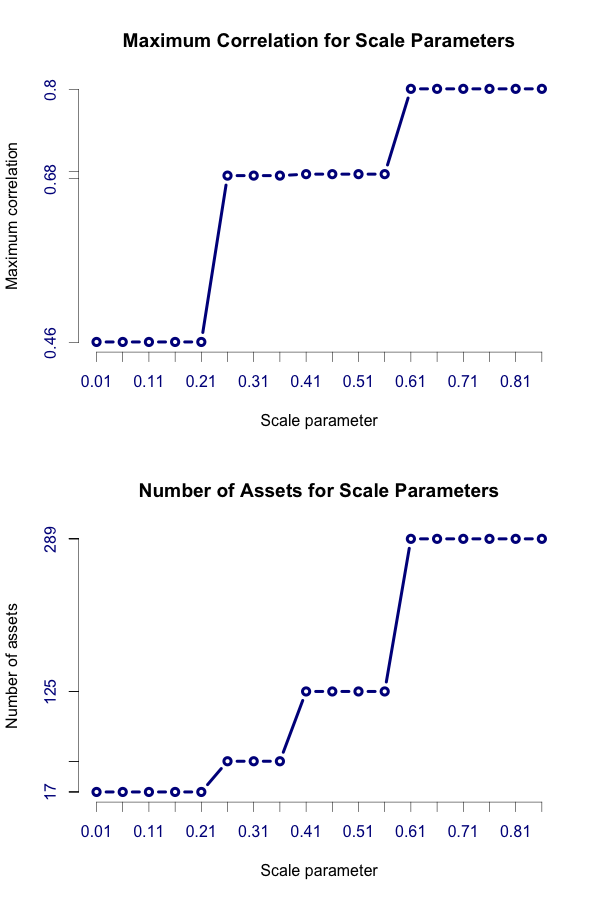

[](http://quantlet.de/index.php?p=info)

## [](http://quantlet.de/) **MVApcapfalgo** [](http://quantlet.de/d3/ia)

```yaml


Name of Quantlet: MVApcapfalgo
 
Published in: MVA

Description: 'This quantlet applies the selection algorithm based on principal component
analysis to identify stocks, which have contributed heavily to the movement in the
original portfolio. In each step the algorithm applies pca to the correlation matrix of
stocks not removed yet. Eigenvectors are selected associated with eigenvalues smaller
than one. Stocks with the highest absolute weight in these eigenvectors are removed.
This step is repeated until either the number of remaining stocks reaches a predefined
threshold or the remaining eigenvalues are sufficiently close to each other. 
Furthermore the algorithm is applied for different scale parameter values.'

Keywords: pca, returns, stock selection, portfolio management, eigenvalues, eigenvectors
     
See also: MVApcapfresults, MVApcapfdata

Author: Christoph Schult

Datafile: Prices.dat
     
Output: 'Two plots illustrating how the result of the algorithm depends on the
selected scale parameter. Furthermore based on the selected assets an equal 
weighted portfolio is contracted and saved in a .dat file'

```



```r

# remove variables
rm(list = ls())

# reset graphics
graphics.off()

# Install packages if not installed
libraries = c("REdaS")
lapply(libraries, function(x) if (!(x %in% installed.packages())) {
  install.packages(x)
})

# Load packages
lapply(libraries, library, quietly = TRUE, character.only = TRUE)


# === input parameters === 

# define paths and filenames
sPathRoot     = "C:/" # for MAC "/Users/"
sReadDataFile = "Prices.dat"
sWriteResults = "Portfolios.dat"

# define auxiliary parameters for the data
sDateFormat = "%d.%m.%Y"

# define returns to compute
sTypeReturns = "grossreturn"
iStepSize    = 1

# define criteria for selection algorithm
iScaleCriteria = as.matrix(seq(0.01, 0.9, 0.05))

# eigenvalues smaller than <iSelectCriteria> are deleted and their respective eigenvectors
iSelectCriteria = 1

# minimum number of assets included after selection process
iminassets = 10

# which correlation method is used (default)
stypecor = "spearman"

# define sample size for random samples
iSampleSize = 1000

# define where the dates are stored in input file
iColDates = 1

# set working directory
setwd(sPathRoot)

# === definition of functions ===

# function to remove missing values from vector
complete = function(x) {
  all(complete.cases(x))
}

# function to compute shares
compshares = function(price, weights, value = 1) {
  shares   = as.matrix((value * weights)/price)
}

# function to find absolute maximum of vector
detectmax = function(x) {
  which(abs(x) == max(abs(x)))
}

# compute returns for a vector
returnsfun = function(x) {
  n = length(x)
  switch(sTypeReturns, 
         grossreturn = (x[(iStepSize + 1):n] - x[1:(n - iStepSize)])/x[1:(n - iStepSize)],
         logreturn = diff(log(x), iStepSize))
}

# define selection algorithm
selectalgofun = function(returnmatrix, scale, iminassets) {
  iassetnum     = ncol(returnmatrix)
  iStop         = sd(eigen(cor(returnmatrix))$values)
  iStopCriteria = iStop * scale
  lCont         = (iStop > iStopCriteria) & (iassetnum > iminassets)
  while (lCont) {
    eigenvalues = eigen(cor(returnmatrix, method = c(stypecor)))$values
    eigenvectors = eigen(cor(returnmatrix, method = c(stypecor)))$vectors
    iStop = sd(eigenvalues)
    if (iStop > iStopCriteria) {
      lreleigenvalues = eigenvalues < iSelectCriteria
      iadelete        = unique(apply(eigenvectors[, lreleigenvalues], 2, detectmax))
      iassetnum       = ncol(returnmatrix) - length(iadelete)
      if (iassetnum > iminassets) {
        returnmatrix = returnmatrix[, -iadelete]
      }
    }
    lCont = (iStop > iStopCriteria) & (iassetnum > iminassets)
  }
  return(returnmatrix)
}

# define function to use different stop criteria
varystopcritfun = function(scalecriteria) {
  datareduced    = selectalgofun(datareturns, scalecriteria, iminassets)
  assetnames     = colnames(datareduced)
  lassets        = colnames(datareturns) %in% assetnames
  cormatrix      = cor(as.matrix(datareturns[, lassets]), method = c(stypecor))
  lowercormatrix = cormatrix[lower.tri(cormatrix, diag = FALSE)]
  maxcor         = max(lowercormatrix)
  return(c(correlation = list(maxcor), assets = list(assetnames)))
}

# === find assets with pca selection criteria ===

# load price data
input         = read.table(sReadDataFile)
dataprices    = input[, -iColDates]
iadatesprices = input[, iColDates]

# compute equal weigthed portfolio of all stocks
startprices    = dataprices[1, ]
weightsvec     = rep(1/length(startprices))
sharesoriginal = compshares(startprices, weightsvec, 1)
valueoriginal  = as.matrix(dataprices) %*% t(sharesoriginal)

# create returns matrix
datareturns = apply(dataprices, 2, returnsfun)
lkeep       = apply(datareturns, 2, complete)
datareturns = datareturns[, lkeep]
dataprices  = dataprices[, lkeep]

# check Kaiser-Meyer-Olkin criterion
KMOScriteria = KMOS(datareturns, use = c("all.obs"))$KMO

if (KMOScriteria < 0.5) {
  print("The period of interest might have not sufficient information to apply pca")
}

# apply selection algorithm to data
resultsalgorithm = apply(iScaleCriteria, 1, varystopcritfun)

# find optimal scale parameter w.r.t. the minimum maximum correlation across assets
iacorrelations = rapply(resultsalgorithm, function(x) x, classes = "numeric")
iaNbassets     = rapply(resultsalgorithm, function(x) length(x), classes = "character")
iaPosOpt       = which(iScaleCriteria == min(iScaleCriteria[iacorrelations == min(iacorrelations)])) 

# plot results of selection algorithm depending on scale parameter
par(mfrow = c(2, 1))

# plot for maximum correlation
x.labels       = iScaleCriteria
x.tick.pos     = iScaleCriteria
y.tick.pos     = unique(as.numeric(round(iacorrelations, 2)))
y.labels       = y.tick.pos

plot(iScaleCriteria, iacorrelations, main = "Maximum Correlation for Scale Parameters",
     type = "b", lwd = 3, col = "darkblue", xlab = "Scale parameter", 
     ylab = "Maximum correlation", axes = FALSE)
axis(side = 2, at = y.tick.pos, label = y.labels, lwd = 0.5, col.axis = "darkblue")
axis(side = 1, at = x.tick.pos, label = x.labels, lwd = 0.5, col.axis = "darkblue")

# plot for number of assets
y.tick.pos     = iaNbassets
y.labels       = y.tick.pos
plot(iScaleCriteria, iaNbassets, main = "Number of Assets for Scale Parameters",
     type = "b", lwd = 3, col = "darkblue", xlab = "Scale parameter", 
     ylab = "Number of assets", axes = FALSE)
axis(side = 2, at = y.tick.pos, label = y.labels, lwd = 0.5, col.axis = "darkblue")
axis(side = 1, at = x.tick.pos, label = x.labels, lwd = 0.5, col.axis = "darkblue")

# calculate equal weight portfoio of stocks selected by pca
assetsopt   = resultsalgorithm[[iaPosOpt]]$assets
lassetsopt  = colnames(dataprices) %in% assetsopt
startprices = dataprices[1, lassetsopt]
weightsvec  = rep(1/length(startprices))
sharespca   = compshares(startprices, weightsvec, 1)
valuepca    = as.matrix(dataprices[, lassetsopt]) %*% t(sharespca)


# collect portfolios for further analysis
output = list(Dates = iadatesprices, PFallassets = as.numeric(valueoriginal), PFoptassets = as.numeric(valuepca))
write.table(output, file = sWriteResults)

```
